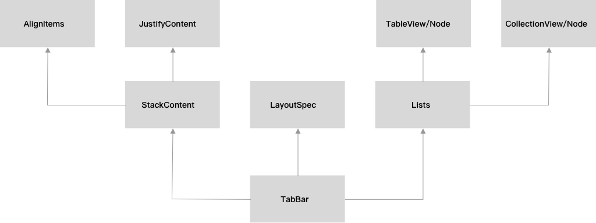

# Texture-Examples

[中文文档]()

`Texture Examples`是[Texture](https://github.com/TextureGroup/Texture)的所有`Example`工程的`Swift`实现，并且在此基础上新增了更详细的讲解，可以容易的入门，同时里面还有[TextureSwiftSupport](https://github.com/TextureCommunity/TextureSwiftSupport)的使用例子，具体可以`Clone`工程下来后慢慢探索，下面是工程的结构：

> 注意：由于`LayoutSpec`、`IGListKit`暂时还没有完成，所以这里的图暂定，后续完成之后再补充上去~

